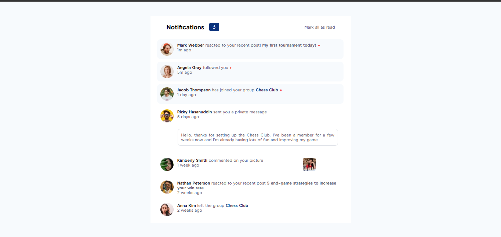

# Frontend Mentor - Notifications page solution

This is a solution to the [Notifications page challenge on Frontend Mentor](https://www.frontendmentor.io/challenges/notifications-page-DqK5QAmKbC). Frontend Mentor challenges help you improve your coding skills by building realistic projects. 

This solution was developed by Paulo Xavier. 

## Table of contents

- [Overview](#overview)
  - [The challenge](#the-challenge)
  - [Screenshot](#screenshot)
  - [Author's feedback](#authors-feedback)
  - [Links](#links)
- [My process](#my-process)
  - [Built with](#built-with)
  - [Useful resources](#useful-resources)
- [Author](#author)

## Overview

### The challenge

Users should be able to:

- Distinguish between "unread" and "read" notifications
- Select "Mark all as read" to toggle the visual state of the unread notifications and set the number of unread messages to zero
- View the optimal layout for the interface depending on their device's screen size
- See hover and focus states for all interactive elements on the page

### Screenshot

### Author's feedback

This was a great challenge to review and apply concepts of HTML, CSS and Javascript. Undoubtedly, this was the hardest challenge that I did. Especially because the HTML structure was crucial for the rest of the project. I changed my HTML 2 times because it was not well-structured. And that was a great experience, because it forces you to adapt your code according the situation and get out of the comfort zone. And this is very important because most of the time we will have to face some situations where we will have to change and adapt the code many times. After structuring the HTML correctly, the CSS also was a bit difficult, because I had to adapt my design to fit in both screens, and it demands more time and attention. Javascript was easier than others, but of course not totally easy, I still had to change some aspects about how I could remove and add the tags tha I was using, but it was much better. I enjoyed this challenge a lot. The harder the challenge, the more you learn. 

### Links

- Solution URL: [Add solution URL here](https://your-solution-url.com)
- Live Site URL: [Add live site URL here](https://your-live-site-url.com)

## My process

### Built with

- **Semantic HTML5 markup**
- **CSS3**
- **Flexbox**
- **Javascript**

### Useful resources

- [Hide and show elements using JS](https://stackoverflow.com/questions/6242976/javascript-hide-show-elementhttps://stackoverflow.com/questions/6242976/javascript-hide-show-element) - This helped me to find the best way to remove elements using Javascript. I had some problems to remove the unread mark (•) when the user presses the button. 
- [How to select a specific part of a text (span tag)](https://www.freecodecamp.org/news/span-html-how-to-use-the-span-tag-with-css/#:~:text=How%20to%20style%20text%20with,the%20attribute%20value%20for%20styling.) - This helped me to discover the tag `` that allows to select a specific part of a text. I had no idea about that before. 

## Author
- Frontend Mentor - [@paulo-xavier](https://www.frontendmentor.io/profile/paulo-xavier)
- Instagram - [@oxavierpaulo](https://www.instagram.com/oxavierpaulo/)
- GitHub - [@paulo-xavier] (https://github.com/paulo-xavier)
- Linkedin - [@Paulo Roberto Xavier da Silva] (https://www.linkedin.com/in/paulo-xavier-15bb6924a/)

